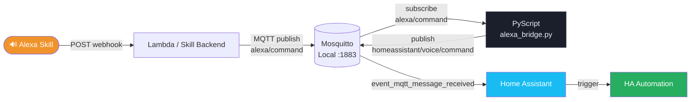
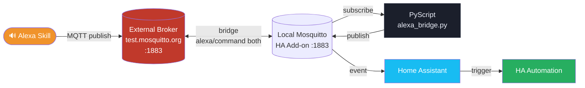
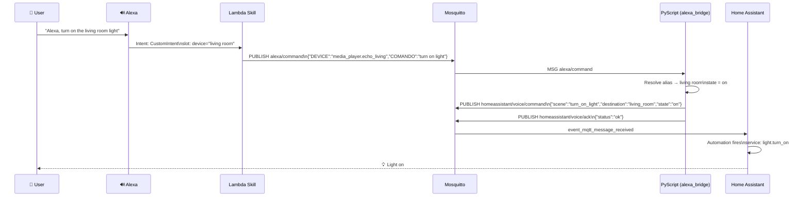
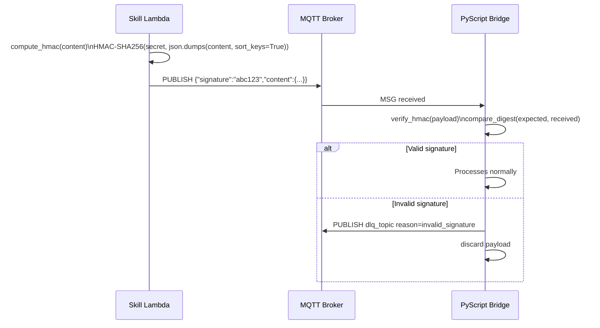

# Alexa Bridge Admin

PyScript bridge to integrate Alexa Skill and Home Assistant via MQTT.

The flow receives messages from the skill on an input topic, resolves the device by alias from the YAML configuration, and publishes a normalized event for Home Assistant automations.

---

## Table of Contents

- [Implementations and Use Cases](#implementations-and-use-cases)
  - [Scenario 1 — Local MQTT (Mosquitto + HA)](#scenario-1--local-mqtt-mosquitto--ha)
  - [Scenario 2 — Remote Bridge](#scenario-2--remote-bridge)
  - [Scenario 3 — Full Integration with Home Assistant](#scenario-3--full-integration-with-home-assistant)
  - [How to create automations with the exposed events](#how-to-create-automations-with-the-exposed-events)
- [Overview](#overview)
- [Project Structure](#project-structure)
- [Requirements](#requirements)
- [Installation](#installation)
- [YAML Configuration](#yaml-configuration)
- [MQTT Contracts](#mqtt-contracts)
- [AlexaBridge Admin Interface](#alexabridge-admin-interface)
- [Runtime Behavior](#runtime-behavior)
- [MQTT Bridge Configuration (Mosquitto)](#mqtt-bridge-configuration-mosquitto)
- [Operation and Troubleshooting](#operation-and-troubleshooting)
- [Security and Best Practices](#security-and-best-practices)
- [Local Development](#local-development)
- [Tests](#tests)
- [Roadmap](#roadmap)

---

## Implementations and Use Cases

### Scenario 1 — Local MQTT (Mosquitto + HA)

Simplest setup: the Alexa Skill publishes to a local Mosquitto broker and PyScript consumes directly.



**Prerequisites:**
- Mosquitto add-on installed in Home Assistant
- MQTT integration configured in HA (`Settings → Devices & Services → MQTT`)
- PyScript enabled

**Topics involved:**

| Direction | Default Topic | Description |
|---|---|---|
| Input | `alexa/command` | Command from the Skill |
| Main output | `homeassistant/voice/command` | Normalized event for automations |
| Acknowledgement | `homeassistant/voice/ack` | Processing ACK |
| Error / DLQ | `homeassistant/voice/dlq` | Rejected messages |

---

### Scenario 2 — Remote Bridge

When the Skill cannot reach the local broker, a Mosquitto bridge is used to replicate topics between a public/external broker and the local broker.



**Bridge configuration** (see [MQTT Bridge Configuration](#mqtt-bridge-configuration-mosquitto)):

```conf
connection alexa_bridge_remote
address test.mosquitto.org:1883
try_private false
start_type automatic
topic alexa/command both 0
```

---

### Scenario 3 — Full Integration with Home Assistant

End-to-end view: from the user's voice command to the scene/automation execution in HA.



---

### How to create automations with the exposed events

The bridge publishes a standardized JSON payload to `homeassistant/voice/command`. Use the `mqtt` trigger in HA to capture and execute actions.

#### Example 1 — Turn on light when a command is received for a room

```yaml
# automations.yaml
- alias: "Alexa → Turn on living room light"
  trigger:
    - platform: mqtt
      topic: homeassistant/voice/command
  condition:
    - condition: template
      value_template: >
        {{ trigger.payload_json.destination == 'living_room'
           and trigger.payload_json.state == 'on' }}
  action:
    - service: light.turn_on
      target:
        area_id: living_room
```

#### Example 2 — Turn off all devices in a room

```yaml
- alias: "Alexa → Turn off everything in the kitchen"
  trigger:
    - platform: mqtt
      topic: homeassistant/voice/command
  condition:
    - condition: template
      value_template: >
        {{ trigger.payload_json.destination == 'kitchen'
           and trigger.payload_json.state == 'off' }}
  action:
    - service: homeassistant.turn_off
      target:
        area_id: kitchen
```

#### Example 3 — Activate a scene by event name

```yaml
- alias: "Alexa → Scene by name"
  trigger:
    - platform: mqtt
      topic: homeassistant/voice/command
  variables:
    scene_name: "{{ trigger.payload_json.scene }}"
  action:
    - service: scene.turn_on
      target:
        entity_id: "scene.{{ scene_name }}"
```

#### Example 4 — Mobile notification on any command

```yaml
- alias: "Alexa → Command notification"
  trigger:
    - platform: mqtt
      topic: homeassistant/voice/command
  action:
    - service: notify.mobile_app_my_phone
      data:
        title: "Alexa Bridge"
        message: >
          Command: {{ trigger.payload_json.name }}
          Room: {{ trigger.payload_json.destination }}
          State: {{ trigger.payload_json.state }}
```

> **Tip:** Use the HA **Template Editor** (`Developer Tools → Template`) to test expressions with the payload before saving the automation.

---

## Overview

- MQTT Input: `mqtt.input_topic`
- Main MQTT Output: `mqtt.output_topic`
- ACK MQTT Output: `mqtt.ack_topic`
- Error MQTT Output: `mqtt.dlq_topic`
- Device mapping: `devices` section in YAML
- Runtime config reload: `pyscript.alexa_bridge_reload` service
- Current wrapper version: `3.3.0`

---

## Project Structure

```
repository.yaml                         # add-on repository metadata
alexa_bridge_admin/                     # installable Home Assistant add-on
  config.yaml                           # add-on metadata
  Dockerfile
  rootfs/app/                           # FastAPI backend + frontend
    assets/alexa_bridge.py              # PyScript template
    assets/alexa_bridge.yaml            # default YAML template
  dev/                                  # local development environment
    run_dev.sh                          # run without HA
    docker-compose.dev.yml
    alexa_bridge.yaml                   # config fixture
tests/                                  # add-on backend unit tests
```

---

## Requirements

- Home Assistant with MQTT configured
- PyScript installed and enabled
- Configuration file at `/config/pyscript/alexa_bridge.yaml`

> If you are using `alexa.bridge.yaml`, copy/rename it to `alexa_bridge.yaml` under `/config/pyscript`.  
> The add-on auto-provisions `alexa_bridge.py` and `alexa_bridge.yaml` on startup when they are absent.

---

## Installation

1. Add the add-on repository in Home Assistant.
2. Install **AlexaBridge Admin**.
3. Open the add-on via Ingress.
4. Check in Diagnostics that `bridge_script_setup` and `bridge_yaml_setup` are `ok`.
5. Run `pyscript.alexa_bridge_reload` to apply the configuration at runtime.

---

## YAML Configuration

```yaml
mqtt:
  input_topic: alexa/command
  output_topic: homeassistant/voice/command
  ack_topic: homeassistant/voice/ack
  dlq_topic: homeassistant/voice/dlq

security:
  enabled: true
  secret: my_secret_key

commands:
  off_keywords:
    - turn off
    - off
    - disable

devices:
  living_room:
    media_player.echo_show:
      aliases:
        - living room light
        - living room
  bedroom:
    media_player.echo_dot:
      aliases:
        - bedroom
        - bedroom light
```

**Automatic defaults when not configured:**

| Field | Default |
|---|---|
| `mqtt.input_topic` | `alexa/command` |
| `mqtt.output_topic` | `homeassistant/voice/command` |
| `mqtt.ack_topic` | `homeassistant/voice/ack` |
| `mqtt.dlq_topic` | `homeassistant/voice/dlq` |
| `commands.off_keywords` | `[turn off, off, disable]` |
| `security.enabled` | `false` |
| `security.secret` | `""` |

---

## Security — HMAC Signature

The `security` section enables HMAC-SHA256 signature verification to authenticate payload origin and prevent command spoofing.

### How it works



### Configuration

| Field | Type | Description |
|---|---|---|
| `security.enabled` | `bool` | Enables/disables HMAC verification (`false` by default) |
| `security.secret` | `string` | Shared key between Skill and Bridge. **Required when `enabled: true`** |
| `security.encrypt_payload` | `bool` | When `true`, the Skill sends encrypted `content` as `ciphertext` and the bridge decrypts it before processing |

### Example with HMAC enabled

```yaml
security:
  enabled: true
  secret: my_super_secret_key
  encrypt_payload: true
```

> ⚠️ **Important:** The `secret` must be identical in the Lambda Skill and in `alexa_bridge.yaml`.  
> Keep the secret out of version control — use environment variables or HA Secrets.

### Schema validation

The `security` field is automatically validated when saving via UI or Raw YAML:
- `security.enabled` must be boolean
- `security.secret` is required (non-empty) when `enabled: true`
- `security.encrypt_payload` must be boolean

### End-to-end payload encryption (Fernet)

With `security.encrypt_payload: true`, the payload does not travel as plaintext over MQTT/webhook.

```json
{
  "enc": "fernet-v1",
  "ciphertext": "gAAAAAB...",
  "signature": "f7a1..."
}
```

- HMAC signature remains required for origin authentication and integrity.
- The bridge can decrypt only with the same `security.secret` used by the Skill.
- On decrypt failure, the event is rejected with `decrypt_failed`.

---

## MQTT Contracts

### Input (`input_topic`)

```json
{
  "DEVICE": "media_player.echo_show",
  "COMANDO": "turn on tv",
  "ORIGIN": "alexa",
  "INTENT": "CustomIntent",
  "correlation_id": "req-123"
}
```

Also accepts envelope with `content`:

```json
{
  "content": {
    "DEVICE": "media_player.echo_show",
    "COMANDO": "turn off tv",
    "ORIGIN": "alexa",
    "INTENT": "CustomIntent"
  }
}
```

### Main Output (`output_topic`)

```json
{
  "scene": "turn_off_tv",
  "name": "turn off tv",
  "source_entity": "media_player.echo_show",
  "source_device_id": "media_player.echo_show",
  "destination": "living_room",
  "state": "off",
  "origin": "alexa",
  "intent": "CustomIntent",
  "correlation_id": "req-123",
  "received_topic": "alexa/command",
  "time": "2026-07-13 21:00:00",
  "wrapper_version": "3.3.0"
}
```

> `state = off` when `COMANDO` contains any term from `commands.off_keywords`, otherwise `state = on`.

### ACK (`ack_topic`)

```json
{
  "status": "ok",
  "detail": "published",
  "received_topic": "alexa/command",
  "correlation_id": "req-123",
  "time": "2026-07-13 21:00:00",
  "wrapper_version": "3.3.0"
}
```

### DLQ (`dlq_topic`)

```json
{
  "reason": "device_not_mapped",
  "raw_payload": "{...}",
  "received_topic": "alexa/command",
  "correlation_id": "req-123",
  "time": "2026-07-13 21:00:00",
  "wrapper_version": "3.3.0"
}
```

**DLQ reasons:** `invalid_payload` · `invalid_signature` · `invalid_type` · `missing_device` · `missing_command` · `device_not_mapped` · `decrypt_failed` · `publish_failed`

---

## AlexaBridge Admin Interface

| Tab | Description |
|---|---|
| Dashboard | KPIs for rooms/devices, reload button, status |
| Configuration | MQTT topics, off_keywords, HMAC signature and Webhook |
| Entities | CRUD with aliases, autocomplete, pagination and filters |
| Raw YAML | Editor with schema validation |
| Backup / Restore | Create, download, restore and remove backups (auto retention) |
| Diagnostics | Script and YAML setup status |
| Audit | Operations log |

---

## Runtime Behavior

- The MQTT trigger listens on the topic configured in `mqtt.input_topic` at script boot.
- When YAML changes, run `pyscript.alexa_bridge_reload` to reload mappings in memory.
- If `mqtt.input_topic` changes, reload PyScript to re-subscribe to the new topic.

---

## MQTT Bridge Configuration (Mosquitto)

### Mosquitto Add-on (Home Assistant)

Add to a custom configuration file in the add-on:

```conf
connection alexa_bridge_remote
address test.mosquitto.org:1883

try_private false
start_type automatic
cleansession true

topic alexa/command both 0
```

### Standalone Mosquitto (outside the add-on)

File: `/etc/mosquitto/conf.d/bridge.conf`

```conf
connection alexa_bridge_remote
address test.mosquitto.org:1883

try_private false
start_type automatic
cleansession true

topic alexa/command both 0
```

```bash
sudo systemctl restart mosquitto
```

---

## Operation and Troubleshooting

| Situation | Action |
|---|---|
| Changed YAML | Run `pyscript.alexa_bridge_reload` |
| Changed script structure | Reload PyScript |
| Processing failure | Inspect `dlq_topic` and `ack_topic` |
| Reload failure via UI | Check the Audit tab |
| Device not mapped | Review `devices` in YAML and aliases |
| Backup creation blocked | Daily limit reached (10/day) |
| Old backups/logs cleanup | Automatic retention of 30 days |

---

## Security and Best Practices

- Restrict MQTT topic ACLs per producer and consumer.
- Avoid sensitive data in payloads and logs.
- Standardize `correlation_id` for end-to-end traceability.
- Monitor errors on the DLQ topic.

---

## Local Development

No Home Assistant required:

```bash
cd AlexaBridgeAddon
./dev/run_dev.sh
# UI  → http://localhost:7843
# API → http://localhost:7843/api/docs
```

Or via Docker:

```bash
cd AlexaBridgeAddon/dev
docker compose -f docker-compose.dev.yml up --build
```

---

## Tests

```bash
cd AlexaBridgeAddon
pytest
```

---

## Roadmap

- Idempotency by `correlation_id` to avoid reprocessing.
- Retry with backoff on MQTT publish for transient failures.
- Integration tests for full flow (input → output → ack → dlq).
- Support for multiple simultaneous brokers.
