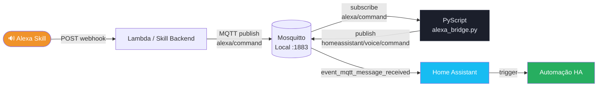
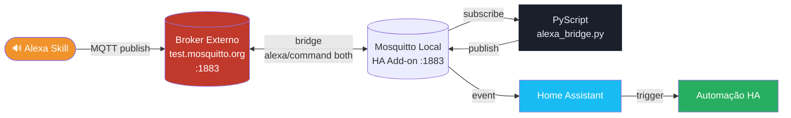
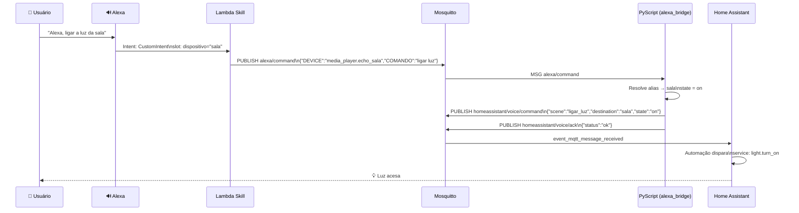
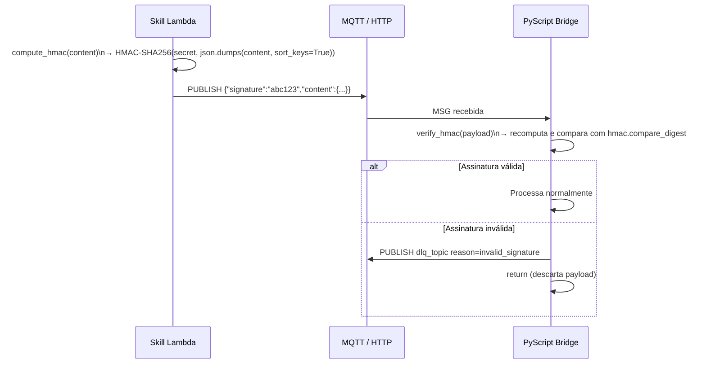

# Alexa Bridge Admin

Bridge em PyScript para integrar Alexa Skill e Home Assistant via MQTT.

O fluxo recebe mensagens da skill em um topico de entrada, resolve dispositivo por alias no YAML e publica evento normalizado para automacoes do Home Assistant.

## Novidades da Versão 0.8.1 / Wrapper 3.4.1

- Entradas MQTT e Webhook com habilitação independente por checkboxes (`transport.mqtt_enabled`, `transport.webhook_enabled`).
- Integração por origem (`integration.mqtt` e `integration.webhook`) com modo `mqtt` ou `event_bus`.
- Event Bus simplificado para `event_name` e enriquecido com origem (`provided_by`, `transport_source`).
- Segurança webhook com suporte a assinatura no header `X-Signature`.
- Validação de schema reforçada no Raw YAML e no save da API para os novos campos de transporte e integração.
- Remoção do campo legado `transport.mode`.
- Auto execução de `pyscript.reload` ao salvar alterações de webhook na interface/API.

Referências:
- Changelog completo: `CHANGELOG.md`
- Matriz de combinações de configuração: `DOCS.md`
 
---

## Sumário

- [Implementações e Cenários de Uso](#implementações-e-cenários-de-uso)
  - [Cenário 1 — MQTT Local (Mosquitto + HA)](#cenário-1--mqtt-local-mosquitto--ha)
  - [Cenário 2 — Bridge Remota](#cenário-2--bridge-remota)
  - [Cenário 3 — Integração Completa com Home Assistant](#cenário-3--integração-completa-com-home-assistant)
  - [Como criar uma Automação com os eventos expostos](#como-criar-uma-automação-com-os-eventos-expostos)
- [Visão Geral](#visão-geral)
- [Estrutura do Projeto](#estrutura-do-projeto)
- [Requisitos](#requisitos)
- [Instalação](#instalação)
- [Configuração YAML](#configuração-yaml)
- [Contratos MQTT](#contratos-mqtt)
- [Interface AlexaBridge Admin](#interface-alexabridge-admin)
- [Comportamento de Runtime](#comportamento-de-runtime)
- [Configuração da Bridge MQTT (Mosquitto)](#configuração-da-bridge-mqtt-mosquitto)
- [Operação e Troubleshooting](#operação-e-troubleshooting)
- [Segurança e Boas Práticas](#segurança-e-boas-práticas)
- [Desenvolvimento Local](#desenvolvimento-local)
- [Testes](#testes)
- [Roadmap](#roadmap)
- [Changelog](CHANGELOG.md)
- [DOCS - Combinações de Configuração](DOCS.md)

---

## Implementações e Cenários de Uso

### Cenário 1 — MQTT Local (Mosquitto + HA)

Configuração mais simples: Alexa Skill publica no broker Mosquitto local e o PyScript consome diretamente.



**Pré-requisitos:**
- Add-on Mosquitto instalado no Home Assistant
- Integração MQTT configurada no HA (`Settings → Devices & Services → MQTT`)
- PyScript habilitado

**Tópicos envolvidos:**

| Direção | Tópico padrão | Descrição |
|---|---|---|
| Entrada | `alexa/command` | Comando vindo da Skill |
| Saída principal | `homeassistant/voice/command` | Evento normalizado para automações |
| Confirmação | `homeassistant/voice/ack` | ACK de processamento |
| Erro / DLQ | `homeassistant/voice/dlq` | Mensagens rejeitadas |

---

### Cenário 2 — Bridge Remota

Quando a Skill não consegue alcançar o broker local, usa-se uma bridge no Mosquitto para replicar os tópicos entre um broker público/externo e o broker local.



**Configuração da bridge** (ver seção [Configuração da Bridge MQTT](#configuração-da-bridge-mqtt-mosquitto)):

```conf
connection alexa_bridge_remote
address test.mosquitto.org:1883
try_private false
start_type automatic
topic alexa/command both 0
```

---

### Cenário 3 — Integração Completa com Home Assistant

Visão de ponta a ponta: da fala do usuário até a execução da cena/automação no HA.



---

### Como criar uma Automação com os eventos expostos

O bridge publica em `homeassistant/voice/command` um payload JSON padronizado. Use o trigger `mqtt` no HA para capturar e executar ações.

#### Exemplo 1 — Ligar luz ao receber comando para um cômodo

```yaml
# automations.yaml
- alias: "Alexa → Ligar luz da sala"
  trigger:
    - platform: mqtt
      topic: homeassistant/voice/command
  condition:
    - condition: template
      value_template: >
        {{ trigger.payload_json.destination == 'sala'
           and trigger.payload_json.state == 'on' }}
  action:
    - service: light.turn_on
      target:
        area_id: sala
```

#### Exemplo 2 — Desligar todos os dispositivos de um cômodo

```yaml
- alias: "Alexa → Desligar tudo na cozinha"
  trigger:
    - platform: mqtt
      topic: homeassistant/voice/command
  condition:
    - condition: template
      value_template: >
        {{ trigger.payload_json.destination == 'cozinha'
           and trigger.payload_json.state == 'off' }}
  action:
    - service: homeassistant.turn_off
      target:
        area_id: cozinha
```

#### Exemplo 3 — Acionar cena pelo nome do evento

```yaml
- alias: "Alexa → Cena pelo nome"
  trigger:
    - platform: mqtt
      topic: homeassistant/voice/command
  variables:
    scene_name: "{{ trigger.payload_json.scene }}"
  action:
    - service: scene.turn_on
      target:
        entity_id: "scene.{{ scene_name }}"
```

#### Exemplo 4 — Notificação no celular ao receber qualquer comando

```yaml
- alias: "Alexa → Notificação de comando"
  trigger:
    - platform: mqtt
      topic: homeassistant/voice/command
  action:
    - service: notify.mobile_app_meu_celular
      data:
        title: "Alexa Bridge"
        message: >
          Comando: {{ trigger.payload_json.name }}
          Cômodo: {{ trigger.payload_json.destination }}
          Estado: {{ trigger.payload_json.state }}
```

> **Dica:** Use o **Template Editor** do HA (`Developer Tools → Template`) para testar expressões com o payload antes de salvar a automação.

---

## Visão Geral

- Entrada MQTT: `mqtt.input_topic`
- Saída MQTT principal: `mqtt.output_topic`
- Saída MQTT de confirmação: `mqtt.ack_topic`
- Saída MQTT de erro: `mqtt.dlq_topic`
- Mapeamento de dispositivos: seção `devices` no YAML
- Reload de configuração em runtime: serviço `pyscript.alexa_bridge_reload`
- Versão atual do wrapper: `3.4.0`

---

## Estrutura do Projeto

```
repository.yaml                         # metadata do repositório de addons
alexa_bridge_admin/                     # addon instalável Home Assistant
  config.yaml                           # metadata do addon
  Dockerfile
  rootfs/app/                           # backend FastAPI + frontend
    assets/alexa_bridge.py              # template do script PyScript
    assets/alexa_bridge.yaml            # template do YAML padrão
  dev/                                  # ambiente de desenvolvimento local
    run_dev.sh                          # script de execução sem HA
    docker-compose.dev.yml
    alexa_bridge.yaml                   # fixture de configuração
tests/                                  # testes unitários do backend
```

---

## Requisitos

- Home Assistant com MQTT configurado
- PyScript instalado e habilitado
- Arquivo de configuração em `/config/pyscript/alexa_bridge.yaml`

> Se estiver usando `alexa.bridge.yaml`, copie/renomeie para `alexa_bridge.yaml` em `/config/pyscript`.
> O addon tenta auto-provisionar `alexa_bridge.py` e `alexa_bridge.yaml` no startup quando ausentes.

---

## Instalação

1. Adicione o repositório do addon no Home Assistant.
2. Instale **AlexaBridge Admin**.
3. Abra o addon via Ingress.
4. Verifique no Diagnóstico se `bridge_script_setup` e `bridge_yaml_setup` estão `ok`.
5. Execute `pyscript.alexa_bridge_reload` para aplicar a configuração em runtime.

---

## Configuração YAML

```yaml
mqtt:
  input_topic: alexa/command
  output_topic: homeassistant/voice/command
  ack_topic: homeassistant/voice/ack
  dlq_topic: homeassistant/voice/dlq

security:
  enabled: true
  secret: minha_chave_secreta

commands:
  off_keywords:
    - desliga
    - desligar
    - turn off

devices:
  sala:
    media_player.echo_show:
      aliases:
        - luz da sala
        - sala
  quarto:
    media_player.echo_dot:
      aliases:
        - quarto
        - luz do quarto
```

**Defaults automáticos quando não configurado:**

| Campo | Padrão |
|---|---|
| `mqtt.input_topic` | `alexa/command` |
| `mqtt.output_topic` | `homeassistant/voice/command` |
| `mqtt.ack_topic` | `homeassistant/voice/ack` |
| `mqtt.dlq_topic` | `homeassistant/voice/dlq` |
| `commands.off_keywords` | `[desliga, desligar, turn off]` |
| `security.enabled` | `false` |
| `security.secret` | `""` |

---

## Segurança — Assinatura HMAC

A seção `security` protege o fluxo com **assinatura HMAC-SHA256** (anti-spoofing),
autenticando a origem da mensagem e evitando injeção de comandos mesmo em broker público.

### Assinatura HMAC (anti-spoofing)



**Webhook HTTP:** a assinatura segue o mesmo contrato do MQTT (no payload), aceitando header `X-Signature` apenas como fallback de compatibilidade:
```
X-Signature: <HMAC-SHA256(secret, payload_body)>
```

### Configuração

| Campo | Tipo | Descrição |
|---|---|---|
| `security.enabled` | `bool` | Ativa verificação HMAC (`false` por padrão) |
| `security.secret` | `string` | Chave compartilhada entre Skill e Bridge. **Obrigatório quando `enabled: true`** |
| `security.encrypt_payload` | `bool` | Quando `true`, a Skill envia `content` cifrado como `ciphertext` e o bridge decifra antes de processar |

### Exemplo com segurança ativa

```yaml
security:
  enabled: true
  secret: minha_chave_super_secreta
  encrypt_payload: true
```

> ⚠️ **Importante:** O `secret` deve ser idêntico na Skill Lambda e no `alexa_bridge.yaml`.
> Mantenha o secret fora do controle de versão — use variáveis de ambiente ou HA Secrets.

### Validação de schema

O campo `security` é validado automaticamente ao salvar via UI ou Raw YAML:
- `security.enabled` deve ser booleano
- `security.secret` é obrigatório (não vazio) quando `enabled: true`
- `security.encrypt_payload` deve ser booleano

### Cifragem ponta a ponta (Fernet)

Com `security.encrypt_payload: true`, o payload não trafega em texto plano no broker/webhook.

```json
{
  "enc": "fernet-v1",
  "ciphertext": "gAAAAAB...",
  "signature": "f7a1..."
}
```

- A assinatura HMAC continua obrigatória para autenticar origem e integridade.
- O bridge só abre o payload com o mesmo `security.secret` da Skill.
- Em falha de decifragem, o evento é rejeitado com `decrypt_failed`.

---

## Webhook HTTP

Além do trigger MQTT, o bridge suporta receber comandos via HTTP webhook do Home Assistant.
Basta configurar o ID em `webhook.ids` no YAML e reiniciar o PyScript — o listener é registrado automaticamente.

```yaml
webhook:
  ids:
    - "8e4a7f0c5d9f4e2ea3f4d1b7c9a8e6f5"
```

Suporta apenas 1 ID. Deixe `ids: []` para desativar webhook.

Compatibilidade: o formato legado `webhook.id` (ID único) ainda é aceito.

### Fluxo Webhook

```
Lambda (transport: http)
  └─ POST /api/webhook/{webhook_id}
         Headers: X-Signature: <HMAC-SHA256(secret, body)>
         Body: {"signature": "abc", "content": {...}}

Bridge (@webhook_trigger)
  ├─ Extrai assinatura do payload (header X-Signature como fallback legado)
  ├─ HMAC-SHA256(secret, signing_base) == assinatura ?
  │     ❌ inválida → return (sem ACK/DLQ)
  │     ✅ válida → _process_command("webhook", ...)
  └─ mesma pipeline MQTT: parse → idempotência → resolve → publish
```

### Validação de schema

- `webhook.ids` deve ser lista de strings (máximo 1)
- `webhook.id` legado ainda é aceito

> ⚠️ Alterar `webhook.ids`/`webhook.id` requer recarregar o **PyScript completo** (não apenas `alexa_bridge_reload`), pois o `@webhook_trigger` é registrado apenas no boot.

---

### Entrada (`input_topic`)

```json
{
  "DEVICE": "media_player.echo_show",
  "COMANDO": "ligar tv",
  "ORIGIN": "alexa",
  "INTENT": "CustomIntent",
  "correlation_id": "req-123"
}
```

Também aceita envelope com `content`:

```json
{
  "content": {
    "DEVICE": "media_player.echo_show",
    "COMANDO": "desliga tv",
    "ORIGIN": "alexa",
    "INTENT": "CustomIntent"
  }
}
```

### Saída principal (`output_topic`)

```json
{
  "scene": "desliga_tv",
  "name": "desliga tv",
  "source_entity": "media_player.echo_show",
  "source_device_id": "media_player.echo_show",
  "destination": "sala",
  "state": "off",
  "origin": "alexa",
  "intent": "CustomIntent",
  "correlation_id": "req-123",
  "received_topic": "alexa/command",
  "time": "2026-07-13 21:00:00",
  "wrapper_version": "3.4.0"
}
```

> `state = off` quando `COMANDO` contém qualquer termo de `commands.off_keywords`, caso contrário `state = on`.

### ACK (`ack_topic`)

```json
{
  "status": "ok",
  "detail": "published",
  "received_topic": "alexa/command",
  "correlation_id": "req-123",
  "time": "2026-07-13 21:00:00",
  "wrapper_version": "3.4.0"
}
```

### DLQ (`dlq_topic`)

```json
{
  "reason": "device_not_mapped",
  "raw_payload": "{...}",
  "received_topic": "alexa/command",
  "correlation_id": "req-123",
  "time": "2026-07-13 21:00:00",
  "wrapper_version": "3.4.0"
}
```

**Motivos de DLQ:** `invalid_payload` · `invalid_signature` · `invalid_type` · `missing_device` · `missing_command` · `device_not_mapped` · `decrypt_failed` · `publish_failed`

---

## Interface AlexaBridge Admin

| Aba | Descrição |
|---|---|
| Dashboard | KPIs de rooms/devices, botão de reload, status |
| Configuração | Tópicos MQTT, off_keywords, assinatura HMAC e Webhook |
| Entidades | CRUD com aliases, autocomplete, paginação e filtros |
| Raw YAML | Editor com validação de schema |
| Backup / Restore | Criar, baixar, restaurar e remover backups (retenção automática) |
| Diagnóstico | Status de setup do script e do YAML + badge de sync do `alexa_bridge.py` |
| Auditoria | Log de operações |

---

## Comportamento de Runtime

- O trigger MQTT escuta o tópico configurado em `mqtt.input_topic` no boot do script.
- Em alteração de YAML, execute `pyscript.alexa_bridge_reload` para recarregar mapeamentos em memória.
- Se alterar `mqtt.input_topic`, recarregue o PyScript para re-assinar o novo tópico.
- No startup do add-on, o `alexa_bridge.py` é sincronizado automaticamente com a versão empacotada.
- Se `webhook.ids` mudar ao salvar Config/YAML, a API retorna `requires_pyscript_restart=true` e a UI orienta reload completo do PyScript.

---

## Configuração da Bridge MQTT (Mosquitto)

### Add-on Mosquitto (Home Assistant)

Adicione em um arquivo de configuração customizado do add-on:

```conf
connection alexa_bridge_remote
address test.mosquitto.org:1883

try_private false
start_type automatic
cleansession true

topic alexa/command both 0
```

### Mosquitto standalone (fora do add-on)

Arquivo: `/etc/mosquitto/conf.d/bridge.conf`

```conf
connection alexa_bridge_remote
address test.mosquitto.org:1883

try_private false
start_type automatic
cleansession true

topic alexa/command both 0
```

```bash
sudo systemctl restart mosquitto
```

---

## Operação e Troubleshooting

| Situação | Ação |
|---|---|
| Alterou YAML | Execute `pyscript.alexa_bridge_reload` |
| Alterou estrutura do script | Recarregue o PyScript |
| Falha de processamento | Inspecione `dlq_topic` e `ack_topic` |
| Falha no reload pela UI | Verifique aba Auditoria |
| Dispositivo não mapeado | Confira `devices` no YAML e aliases |
| Criação de backup bloqueada | Limite diário atingido (10/dia) |
| Limpeza de backups/logs antigos | Retenção automática de 30 dias |
| Alterou `webhook.ids` e não aplicou | Faça reload completo do PyScript (não apenas `alexa_bridge_reload`) |
| Verificar sync do script do bridge | Abra a aba Diagnóstico e valide badge "Sync do alexa_bridge.py" |

---

## Segurança e Boas Práticas

- Restrinja ACL dos tópicos MQTT por produtor e consumidor.
- Evite dados sensíveis em payload e logs.
- Padronize `correlation_id` para rastreabilidade fim a fim.
- Monitore erros no tópico de DLQ.

---

## Desenvolvimento Local

Sem necessidade de Home Assistant:

```bash
cd AlexaBridgeAddon
./dev/run_dev.sh
# UI  → http://localhost:7843
# API → http://localhost:7843/api/docs
```

Ou via Docker:

```bash
cd AlexaBridgeAddon/dev
docker compose -f docker-compose.dev.yml up --build
```

---

## Testes

```bash
cd AlexaBridgeAddon
pytest
```

---

## Roadmap

- Idempotência por `correlation_id` para evitar reprocessamento.
- Retry com backoff na publicação MQTT em falhas transientes.
- Testes de integração para fluxo completo (entrada → saída → ack → dlq).
- Suporte a múltiplos brokers simultâneos.


## Visao Geral

- Entrada MQTT: mqtt.input_topic
- Saida MQTT principal: mqtt.output_topic
- Saida MQTT de confirmacao: mqtt.ack_topic
- Saida MQTT de erro: mqtt.dlq_topic
- Mapeamento de dispositivos: secao devices no YAML
- Reload de configuracao em runtime: servico pyscript.alexa_bridge_reload
- Versao atual do wrapper: 3.4.0

## Estrutura do Projeto

- repository.yaml: metadata do repositorio de addons
- alexa_bridge_admin/: addon instalavel Home Assistant
  - config.yaml: metadata do addon
  - Dockerfile
  - rootfs/app/: backend FastAPI + frontend
  - rootfs/app/assets/alexa_bridge.py: template do script PyScript
  - rootfs/app/assets/alexa_bridge.yaml: template do YAML padrao
- tests/: testes unitarios do backend do addon

Arquivos operacionais do bridge (alvo final no Home Assistant):

- alexa_bridge.py: script PyScript principal
- alexa_bridge.yaml: configuracao do bridge

## Requisitos

- Home Assistant com MQTT configurado
- PyScript instalado e habilitado
- Arquivo de configuracao no caminho:
  - /config/pyscript/alexa_bridge.yaml

Observacoes:

- O script usa um unico arquivo de configuracao.
- Se voce estiver usando alexa.bridge.yaml, copie/renomeie para alexa_bridge.yaml em /config/pyscript.
- O addon tenta auto-provisionar alexa_bridge.py e alexa_bridge.yaml no startup quando ausentes.

## Instalacao

1. Adicione o repositorio do addon no Home Assistant.
2. Instale AlexaBridge Admin.
3. Abra o addon via Ingress.
4. Verifique no diagnostico se bridge_script_setup e bridge_yaml_setup estao ok.
5. Execute o servico pyscript.alexa_bridge_reload para aplicar configuracao em runtime.

## Configuracao YAML

Exemplo:

```yaml
mqtt:
  input_topic: alexa/command
  output_topic: homeassistant/voice/command
  ack_topic: homeassistant/voice/ack
  dlq_topic: homeassistant/voice/dlq

commands:
  off_keywords:
    - desliga
    - desligar
    - turn off

devices:
  sala:
    media_player.echo_show:
      aliases:
        - media_player.echo_show
        - amzn1.ask.device.EXEMPLO
```

Defaults aplicados automaticamente quando nao configurado:

- mqtt.input_topic = alexa/command
- mqtt.output_topic = homeassistant/voice/command
- mqtt.ack_topic = homeassistant/voice/ack
- mqtt.dlq_topic = homeassistant/voice/dlq
- commands.off_keywords = [desliga, desligar, turn off]

## Contrato de Entrada MQTT

Mensagem esperada:

```json
{
  "DEVICE": "media_player.echo_show",
  "COMANDO": "ligar tv",
  "ORIGIN": "alexa",
  "INTENT": "CustomIntent",
  "correlation_id": "req-123"
}
```

Tambem aceita envelope com content:

```json
{
  "content": {
    "DEVICE": "media_player.echo_show",
    "COMANDO": "desliga tv",
    "ORIGIN": "alexa",
    "INTENT": "CustomIntent"
  }
}
```

## Contrato de Saida Principal

Publicado em mqtt.output_topic:

```json
{
  "scene": "desliga_tv",
  "name": "desliga tv",
  "source_entity": "media_player.echo_show",
  "source_device_id": "media_player.echo_show",
  "destination": "sala",
  "state": "off",
  "origin": "alexa",
  "intent": "CustomIntent",
  "correlation_id": "req-123",
  "received_topic": "alexa/command",
  "time": "2026-07-13 21:00:00",
  "wrapper_version": "3.4.0"
}
```

Regras:

- state = off quando COMANDO contem qualquer termo de commands.off_keywords
- caso contrario, state = on
- correlation_id vem do payload de entrada quando presente
- se correlation_id nao vier, o wrapper gera um UUID

## Contrato de ACK

Publicado em mqtt.ack_topic:

```json
{
  "status": "ok",
  "detail": "published",
  "received_topic": "alexa/command",
  "correlation_id": "req-123",
  "time": "2026-07-13 21:00:00",
  "wrapper_version": "3.4.0"
}
```

Cenarios de erro usam status = error e detail com o motivo.

## Contrato de DLQ

Publicado em mqtt.dlq_topic quando ocorre rejeicao de entrada:

```json
{
  "reason": "missing_device",
  "raw_payload": "{...}",
  "received_topic": "alexa/command",
  "correlation_id": "req-123",
  "time": "2026-07-13 21:00:00",
  "wrapper_version": "3.4.0"
}
```

Motivos atuais:

- invalid_payload
- missing_device
- missing_command
- device_not_mapped
- publish_failed

## Interface AlexaBridge Admin

Abas da interface:

- Dashboard
- Configuracao
- Entidades
- Raw YAML
- Backup / Restore
- Diagnostico
- Auditoria

Recursos principais:

- Entidades com CRUD via pop-up
- aliases multiplos por dispositivo
- autocomplete de entity_id para media_player.*
- importacao/exportacao de devices em YAML
- paginacao e filtros
- editor Raw YAML com Recarregar, Validar schema e Salvar
- Backup / Restore com criar, baixar, restaurar e remover
- Auditoria de operacoes
- Diagnostico com status de setup do script e do YAML

## Comportamento de Runtime

- O trigger MQTT escuta o topico configurado em mqtt.input_topic no boot do script.
- O filtro interno valida se a mensagem recebida pertence aos topicos permitidos.
- Em alteracao de YAML, execute pyscript.alexa_bridge_reload para recarregar mapeamentos e topicos em memoria.
- Se alterar mqtt.input_topic, recarregue o PyScript para re-assinar o novo topico de entrada.

## Bridge MQTT com Broker Secundario

Se o Home Assistant ja esta conectado ao Mosquitto local e voce quer que ele tambem receba/publice mensagens no broker secundario test.mosquitto.org, a melhor abordagem e criar uma bridge MQTT no Mosquitto local.

Cenario:

```text
Home Assistant
  |
  v
Mosquitto Local
  |
  v
test.mosquitto.org:1883
```

Assim:

- O Home Assistant continua usando apenas o broker local.
- O Mosquitto replica os topicos desejados para o broker externo.
- Nao e necessario criar uma segunda integracao MQTT no Home Assistant.

### Configuracao da Bridge no Add-on Mosquitto

No add-on Mosquitto do Home Assistant, adicione configuracao equivalente em um arquivo customizado:

```conf
connection alexa_bridge

address test.mosquitto.org:1883

try_private false
start_type automatic
cleansession true

topic alexa/command both 0
```

Se quiser encaminhar tudo:

```conf
topic # both 0
```

Recomendacao para este projeto:

```conf
topic alexa/command both 0
```

### Mosquitto fora do Add-on

Arquivo:

```text
/etc/mosquitto/conf.d/bridge.conf
```

Conteudo:

```conf
connection alexa_bridge

address test.mosquitto.org:1883

try_private false
start_type automatic
cleansession true

topic alexa/command both 0
```

Depois aplique:

```bash
sudo systemctl restart mosquitto
```

## Operacao e Troubleshooting

Verifique logs para:

- erro de leitura YAML
- payload invalido
- dispositivo nao mapeado
- erro de publicacao MQTT

Acoes operacionais:

1. Alterou YAML: execute pyscript.alexa_bridge_reload.
2. Alterou estrutura do script: recarregue o PyScript.
3. Falha de processamento: inspecione mqtt.dlq_topic e mqtt.ack_topic.
4. Falha no reload pela UI: confira aba Auditoria e o detalhe de erro HTTP.

## Seguranca e Boas Praticas

- Restrinja ACL dos topicos MQTT por produtor e consumidor.
- Evite dados sensiveis em payload e logs.
- Padronize correlation_id para rastreabilidade fim a fim.
- Use monitoramento de erros no topico de DLQ.

## Desenvolvimento local

```bash
cd AlexaBridgeAddon
python3 -m venv .venv
source .venv/bin/activate
pip install -e ".[dev]"
uvicorn alexa_bridge_admin.rootfs.app.main:app --reload --port 8099
```

## Testes

```bash
cd AlexaBridgeAddon
pytest
```
